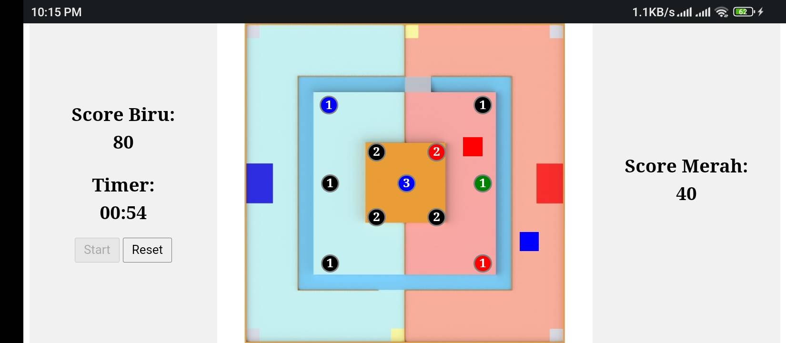

## Robot Tracking and Scoring Website for ABU Robocon 2023

This is a repository for a web application specifically designed for ABU Robocon 2023. The website allows real-time tracking of opponent robots, score calculation, and includes a timer. The tracking feature provides information about the positions of opponent robots and the poles they have acquired or are targeting. This enables our team's robot controller to strategize effectively and increase the chances of winning the competition.

### Technologies Used

- HTML
- CSS
- JavaScript
- Firebase Realtime Database

### Features

1. Real-Time Tracking: The website provides real-time tracking of opponent robots, allowing our team to monitor their positions throughout ABU Robocon 2023.

2. Pole Status: Each pole is represented by a circular button that indicates its status. The button changes color/state based on the actions performed by the opponent team. The colors represent the following states:
   - Black: No ring has been scored in the pole.
   - Green: The opponent team is targeting the pole.
   - Red: The pole has been successfully scored by the red team, resulting in points being added to their score.
   - Blue: The pole has been successfully scored by the blue team, resulting in points being added to their score.

3. Score Calculation: The website automatically calculates the score based on the poles acquired by each team. The points for each pole are predefined, and the respective team's score is updated accordingly.

4. Timer: The website includes a timer feature that helps track the duration of the ABU Robocon 2023 competition.

### Usage

To use the website for ABU Robocon 2023, follow these steps:

1. Clone the repository to your local machine.
2. Open the `firebase-config.js` file in a text editor.
3. Replace the Firebase configuration details with your own Firebase project credentials. You can create a new Firebase project and obtain the configuration details from the Firebase console.
4. Save the `firebase-config.js` file.
5. Open the `index.html` file in a web browser.
6. The website will load, and you will be able to view the opponent robot positions, pole statuses, and the timer.
7. Have a designated person responsible for updating the positions of opponent robots and the status of each pole in real-time.
8. Ensure that both the person updating the positions and the team's robot controller are using devices with the same aspect ratio for accurate reference positioning.
9. The designated person can use the website's interface to move the opponent robot positions and update the status of each pole accordingly.
10. The team's robot controller, using a device with the same aspect ratio, can view the tracked positions and pole statuses accurately aligned with the field background image.
11. By allowing a designated person to manipulate the opponent robot positions and pole statuses in real-time, the team can have better situational awareness and make faster strategic decisions during.

Please note that using devices with different aspect ratios may result in misalignment of the tracked positions and pole statuses between the person updating the positions and the team's robot controller. It is crucial to use devices with the same aspect ratio to ensure accurate reference positioning.

### Screenshots

*Screenshot of the website showing opponent robot positions and pole statuses during ABU Robocon 2023.*

### Contribution

Contributions to the project are welcome. If you would like to make any enhancements or fix any issues, please follow these steps:

1. Fork the repository.
2. Create a new branch.
3. Make your changes and enhancements.
4. Test the application thoroughly.
5. Submit a pull request with a detailed explanation of the changes.
